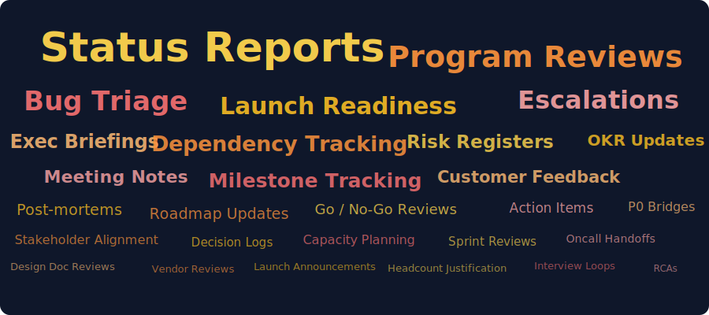
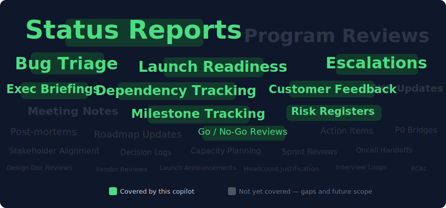

<div align="center">

# AI TPM Copilot

A 14-day vibe coding challenge — from blank repo to multi-agent AI copilot for TPMs.

[](#capabilities)
[](https://www.python.org/)
[](https://streamlit.io/)
[](LICENSE)

[Blog](https://shwsingh.github.io/pm-tpm-ai-tools/) · [Component Reference](https://shwsingh.github.io/pm-tpm-ai-tools/components.html) · [GitHub](https://github.com/shwsingh/pm-tpm-ai-tools)

</div>

---

## The problem

TPM work has two modes: **judgment** (what should we do, and why?) and **production** (write the doc that captures what we decided). The problem is that production dominates.

Product and program professionals spend [73% of their time on tactical work](https://www.pendo.io/pendo-blog/tactical-vs-strategic-where-product-managers-really-spent-their-time-in-2019/) — status updates, triage, reports, coordination — while believing it should be closer to 50% strategic. [60% of the average knowledge worker's day](https://asana.com/resources/anatomy-of-work) goes to "work about work." [McKinsey estimates](https://www.mckinsey.com/capabilities/tech-and-ai/our-insights/the-economic-potential-of-generative-ai-the-next-productivity-frontier) AI can reclaim 10–25% of that time on writing and synthesis tasks.

**The full surface area of a TPM's week — mostly production, not judgment:**



AI is bad at judgment. It doesn't know your org, your stakeholders, or the history. But it's surprisingly good at production — turning structured inputs into standard outputs. This copilot targets the highest-frequency production tasks: the ones a TPM touches every single week.

**What this copilot handles today** (green = covered, gray = not yet):



**The shift per task:**

| Task | Before | After |
|------|--------|-------|
| Weekly status report | Write from scratch — 45–60 min | Fill 5 fields, review AI draft — ~10 min |
| Bug triage (batch of 10) | Read each, assign P0–P3, route — 30–40 min | Review AI classifications, override where needed — ~5 min |
| Launch risk assessment | Manually scan notes, form opinion — 1–2 hrs | Paste notes, get scored risk + GO/NO-GO — ~10 min |
| Customer feedback synthesis | Read 50 items, write themes — 1–2 hrs | Paste feedback, review themes + next steps — ~15 min |
| Exec briefing | Pull GitHub data + write narrative — 1 hr | One click, review output — ~10 min |
| Dependency risk | Trace graph manually, write risks — 1 hr | Describe dependencies, get critical path analysis — ~10 min |

> These are directional estimates based on real TPM workflows — not benchmarked. Your mileage will vary based on program complexity and how much you trust the first draft.

### Why these tasks, not others

Not every TPM task is equally AI-ready. Tasks were selected against four criteria:

| Criteria | What it means |
|----------|--------------|
| **High frequency** | Happens weekly — leverage compounds over time |
| **Structured I/O** | Clear inputs, predictable output format — writable as a skill spec |
| **Pattern-heavy** | Follows rules AI can apply consistently, not deep org-specific context |
| **Data pasteable today** | Inputs can be provided without live system integrations |

Tasks that scored well on all four got built first:

| Task | Weekly | Structured I/O | Pattern-heavy | Data pasteable |
|------|--------|---------------|---------------|----------------|
| Status Reports | ✅ | ✅ | ✅ | ✅ |
| Bug Triage | ✅ | ✅ | ✅ | ✅ |
| Launch Readiness | ✅ | ✅ | ✅ | ✅ |
| Escalations | ✅ | ✅ | ✅ | ✅ |
| Customer Feedback | ✅ | ✅ | ✅ | ✅ |
| Dependency Tracking | ✅ | ✅ | ✅ | ✅ |
| Exec Briefings | ✅ | ✅ | ✅ | ✅ (via GitHub) |

Tasks that didn't make the cut — and why:

| Task | Why not prioritized |
|------|-------------------|
| **Program Reviews** | Output is typically a deck or slide narrative — harder format to generate as structured text. Coming soon. |
| OKR Updates | Quarterly cadence, low weekly leverage |
| Meeting Notes | Already solved well by Otter.ai, Notion AI, Fireflies |
| Roadmap Updates | Low structure, high judgment — no clear I/O contract |
| Post-mortems | Multi-person collaborative process, not a single-user production task |
| Capacity Planning | Requires financial and headcount data not easily accessible |
| Oncall Handoffs | Highly team-specific, better handled by on-call tooling |

---

## What this is

A Streamlit app that ships one working TPM capability per day — starting with keyword heuristics, graduating to Claude-powered agents, multi-agent orchestration, and a real MCP server wired to Claude Desktop. Every day is a committed, demo-able increment.

Built by **Shweta Singh** · Senior Manager, TPM · Google

---

## Capabilities

[](https://shwsingh.github.io/pm-tpm-ai-tools/)

| Capability | What it does | AI concept |
|-----------|-------------|------------|
| **Launch Risk Analyzer** | Scores a launch across 5 risk dimensions, flags signals, gives GO/NO-GO | Heuristic → LLM |
| **Bug Triage Agent** | Classifies severity (P0–P3), assigns owner, decides escalate vs. route-to-lead | Agent + output contract |
| **3-Stage Pipeline** | Ingest → Triage → Escalation Handler, stage outputs feed next stage | Orchestration |
| **Status Report Skill** | Structured input → exec report → 5-dimension quality eval | Skill spec + eval |
| **Knowledge Base** | Upload `.txt` `.md` `.docx` `.csv`, keyword-chunked search | RAG foundation |
| **Feedback Agent** | Per-item sentiment + themes + severity, aggregate TPM next steps | LLM + Claude |
| **Dependency Agent** | Reasons over full dependency graph — critical path, cascading risks | LLM graph reasoning |
| **AgentHarness + Evals** | Unified Claude calls with retry/logging; Claude-as-judge scores outputs | Infrastructure + eval |
| **Multi-Agent Orchestrator** | Free-text request → agent loop → Claude picks tools → exec briefing | Multi-agent + tool use |
| **MCP Server** | Resources, tools, and prompts exposed to Claude Desktop via MCP protocol | MCP |
| **Executive TPM Copilot** | Live GitHub data + all agents → one exec briefing with velocity + status | Capstone |

---

## Quick start

```bash
git clone https://github.com/shwsingh/pm-tpm-ai-tools.git
cd pm-tpm-ai-tools
source venv/bin/activate
streamlit run projects/tpm_pm_toolkit/app.py
```

> Requires `ANTHROPIC_API_KEY` for Days 9–14 features.

---

## Architecture

<details>
<summary>Day 14 — layered architecture</summary>


**Layers explained:**

| Layer | Role | Key components |
|-------|------|---------------|
| Interface | What the user sees and types into | 9 Streamlit sections, one per capability |
| Orchestration | How work gets routed and sequenced | Agent loop (Claude decides), 3-stage pipeline (code decides) |
| Infrastructure | Cross-cutting: reliability, cost, eval | AgentHarness (retry, token log), Claude-as-judge |
| LLM | All model calls, one place | Claude API via AgentHarness |
| Data | Persistence within a session | Session state, doc chunks, dep graph, token log |
| Protocol | External systems | MCP server (Claude Desktop), GitHub API (live data) |

→ [Full component reference](https://shwsingh.github.io/pm-tpm-ai-tools/components.html)

</details>

---

## Blog

Three posts published — deep-dive series coming next:

| Post | What it covers |
|------|---------------|
| [Week 1 — The contract before the code](https://shwsingh.github.io/pm-tpm-ai-tools/) | Days 0–5: why output contracts matter more than models |
| [Week 2 — What AI made me honest about](https://shwsingh.github.io/pm-tpm-ai-tools/) | Days 6–12: skills, agents, evals, and what I'd been doing on autopilot |
| [Challenge complete — 14 days, 14 capabilities](https://shwsingh.github.io/pm-tpm-ai-tools/) | Full retrospective: what shipped, what surprised me, what's next |

**Coming next** — a deep-dive series on each capability:
- How the output contract made the LLM swap on Day 9 a one-line change
- Why I built the eval framework on Day 11, not Day 1 — and what it cost me
- MCP from scratch: Resources vs. Tools vs. Prompts, and when each one matters
- The multi-agent orchestrator: what changed when Claude started calling the tools

---

## How to use it

### 1. Start the app

```bash
git clone https://github.com/shwsingh/pm-tpm-ai-tools.git
cd pm-tpm-ai-tools
source venv/bin/activate
streamlit run projects/tpm_pm_toolkit/app.py
```

The homepage shows all capabilities as cards. Click any card to jump to that tool.

### 2. No API key needed (Days 1–8)

These tools run on heuristics and local logic — no Claude calls:

| Tool | What to do |
|------|-----------|
| **Launch Risk Analyzer** | Paste your launch notes → get a risk score across 5 dimensions + GO/NO-GO |
| **Bug Triage Agent** | Paste a bug description → get P0–P3 severity, suggested owner, escalate/route decision |
| **3-Stage Pipeline** | Run a batch of bugs through Ingest → Triage → Escalation Handler end-to-end |
| **Status Report** | Fill in project fields → get a structured exec-ready status report |
| **Knowledge Base** | Upload `.txt` `.md` `.docx` `.csv` files → search across them by keyword |

### 3. Add your Anthropic API key (Days 9–14)

```bash
export ANTHROPIC_API_KEY=your_key_here
```

Then restart the app. These capabilities unlock:

| Tool | What to do |
|------|-----------|
| **Feedback Agent** | Paste raw customer feedback items → get per-item sentiment, themes, severity, TPM next steps |
| **Dependency Agent** | Describe your team dependencies → get critical path, cascade risks, mitigation options |
| **AgentHarness + Evals** | Run any capability → see token usage, retry logs, Claude-as-judge quality scores |
| **Multi-Agent Orchestrator** | Type a free-text request → Claude picks the right agents, loops until done, returns exec briefing |
| **Executive TPM Copilot** | Enter your GitHub repo → get a full velocity + health briefing pulled from live data |

### 4. Wire the MCP server to Claude Desktop (optional)

```bash
# Start the MCP server
python projects/tpm_pm_toolkit/mcp_server.py
```

In Claude Desktop → Settings → MCP Servers, add:
```json
{
  "tpm-copilot": {
    "command": "python",
    "args": ["/path/to/projects/tpm_pm_toolkit/mcp_server.py"]
  }
}
```

Now Claude Desktop can call your TPM tools directly mid-conversation.

---

## Follow along day by day

This repo is designed to be recreated. Every day is an isolated, committed increment — you can check out any day's state and see exactly what existed at that point.

```bash
# See all day commits
git log --oneline | grep "Day"

# Check out a specific day's state
git checkout <commit-hash>
```

### The learning path

| Days | What you're learning | Key concept |
|------|---------------------|-------------|
| 1–2 | Stand up a Streamlit app, ship a working heuristic tool | Vibe coding, output contracts |
| 3–4 | Define skills as specs separate from code | Skills architecture |
| 5–6 | Build an agent with a defined input/output contract | Agents, orchestration |
| 7–8 | Add summarization and a simple RAG knowledge base | Summarization, RAG |
| 9–10 | Make your first real LLM calls with Claude | Anthropic SDK, prompt design |
| 11 | Build an eval framework — Claude grades Claude | LLM-as-judge, AgentHarness |
| 12 | Upgrade to agentic loops — Claude calls tools, reasons, loops | Tool use, agent loops |
| 13 | Expose your tools via MCP protocol | MCP resources, tools, prompts |
| 14 | Wire everything into one end-to-end capstone | Multi-agent, live data |

### Resources per day

- **Design decisions**: [`design_decisions/`](design_decisions/) — why each choice was made, alternatives considered
- **Progress tracker**: [`challenge/progress_tracker.md`](challenge/progress_tracker.md) — what shipped each day, key decisions, lessons
- **Lessons learned**: [`lessons_learned/`](lessons_learned/) — what surprised me, what I'd do differently
- **Blog posts**: [shwsingh.github.io/pm-tpm-ai-tools](https://shwsingh.github.io/pm-tpm-ai-tools/) — narrative writeups for each week

---

## Gaps — what it would take to make this a real product

This is a 14-day prototype. It works, it's demo-able, and the AI capabilities are real. But there's a meaningful gap between "works in a demo" and "a TPM uses this every Monday morning." Here's what's missing:

### Data & integrations
- **No live data ingestion** — you paste inputs manually. A real product pulls from Jira, Linear, GitHub, Slack automatically
- **No persistent memory** — session state resets on every reload. A real product remembers your programs, teams, and history
- **No auth or multi-user** — one session, one user. A real product has login, org-level data isolation, and role-based access

### Output quality
- **Prompts aren't tuned** — the Claude prompts work but aren't optimized for your specific team's language, norms, or escalation thresholds
- **Evals are thin** — Claude-as-judge scoring exists but there's no benchmark dataset of "good vs. bad" TPM outputs to calibrate against
- **No feedback loop** — users can't rate outputs, so the system can't improve from corrections over time

### Production readiness
- **No deployment** — runs locally only. A real product needs hosting, CI/CD, and uptime
- **No cost controls** — token usage is logged but there are no budget limits or model routing (cheap model for drafts, expensive model for evals)
- **No error handling at scale** — the AgentHarness retries on failure, but there's no graceful degradation when Claude is slow or unavailable

### The honest gap summary

| What exists | What's needed |
|-------------|---------------|
| Manual paste inputs | Auto-pull from Jira, GitHub, Slack |
| Session-only memory | Persistent program + team context |
| Single user, local | Auth, org isolation, hosted |
| Generic prompts | Tuned to your team's norms |
| Thin eval layer | Benchmark dataset + human feedback loop |
| Local MCP server | Cloud-hosted MCP with real integrations |

The architecture is sound — AgentHarness, skill contracts, MCP server, eval layer are all the right primitives. What's missing is the data layer and the feedback loop that turns a demo into a product.

---

## Docs

| Resource | Link |
|----------|------|
| 14-day plan | [`challenge/14_day_plan.md`](challenge/14_day_plan.md) |
| Progress tracker | [`challenge/progress_tracker.md`](challenge/progress_tracker.md) |
| Design decisions | [`design_decisions/`](design_decisions/) |
| Lessons learned | [`lessons_learned/`](lessons_learned/) |
