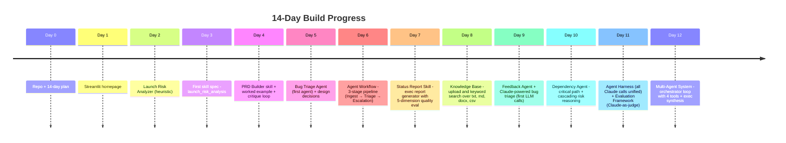
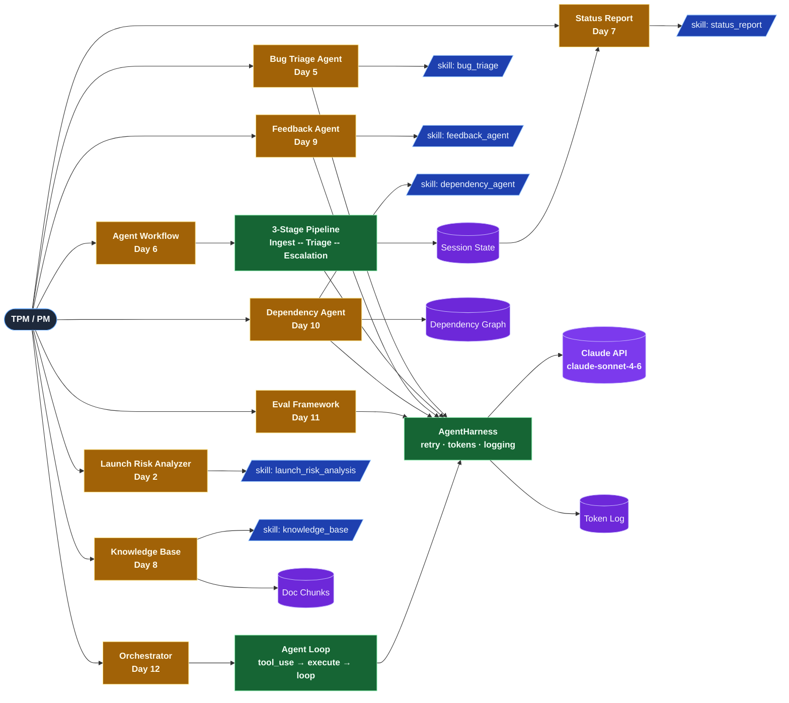

<div align="center">

# 🚀 AI TPM Copilot

A 14-day advanced vibe coding challenge to build an AI-powered TPM/Product Management Copilot.

[](https://www.python.org/)
[](LICENSE)
[](https://streamlit.io/)
[](#progress)
[](https://shwsingh.github.io/pm-tpm-ai-tools/)

📝 **Weekly blog:** [shwsingh.github.io/pm-tpm-ai-tools](https://shwsingh.github.io/pm-tpm-ai-tools/)

</div>

---

## Project Goal

Build a portfolio-quality AI TPM Copilot capable of:

### TPM Use Cases

* Launch Risk Analysis
* Bug Triage
* Dependency Management
* PRD Generation
* Executive Reporting
* Customer Feedback Analysis

### AI Engineering

* Skills
* Agents
* RAG
* Evaluation Frameworks
* Multi-Agent Systems

### Agent Infrastructure

* MCP Servers
* Agent Workflows

## Quick Start

```bash
# 1. Clone the repository
git clone https://github.com/<your-username>/pm-tpm-ai-tools.git
cd pm-tpm-ai-tools

# 2. Create and activate a virtual environment
python -m venv venv
source venv/bin/activate        # On Windows: venv\Scripts\activate

# 3. Install dependencies
pip install streamlit python-docx pandas

# 4. Run the app
streamlit run projects/tpm_pm_toolkit/app.py
```

## Progress

| Day    | Capability              | Status     |
| ------ | ----------------------- | ---------- |
| Day 1  | TPM/PM Toolkit Homepage | ✅ Complete |
| Day 2  | Launch Risk Analyzer    | ✅ Complete |
| Day 3  | Launch Risk Skill       | ✅ Complete |
| Day 4  | PRD Builder Skill       | ✅ Complete |
| Day 5  | Bug Triage Agent        | ✅ Complete |
| Day 6  | Agent Workflow          | ✅ Complete |
| Day 7  | Status Report Skill     | ✅ Complete |
| Day 8  | Knowledge Base / RAG    | ✅ Complete |
| Day 9  | Feedback Agent          | ✅ Complete |
| Day 10 | Dependency Agent        | ✅ Complete |
| Day 11 | Evaluation Framework    | ✅ Complete |
| Day 12 | Multi-Agent System      | ✅ Complete |
| Day 13 | TPM MCP Server          | ☐ Planned  |
| Day 14 | Executive TPM Copilot   | ☐ Planned  |

### Build timeline



### Current architecture (Day 12)



**Legend** — yellow = UI, green = agent/infrastructure, blue = skill spec, purple = data/LLM, navy = user.
All Claude calls route through `AgentHarness` → `Claude API`. The Day 12 orchestrator adds an `Agent Loop` layer on top.

Full per-day delta diagrams, planned-future layer, mindmap, and Gantt → [`challenge/project_evolution.md`](challenge/project_evolution.md).

## Project Structure

```
pm-tpm-ai-tools/
├── projects/
│   └── tpm_pm_toolkit/
│       └── app.py                        # Single-file Streamlit app (all Days 1-8)
│
├── skills/                               # Reusable AI skill specs (markdown)
│   ├── launch_risk_analysis.md           # Day 3
│   ├── prd_builder.md                    # Day 4
│   ├── bug_triage.md                     # Day 5
│   ├── status_report.md                  # Day 7
│   ├── knowledge_base.md                 # Day 8
│   ├── feedback_agent.md                 # Day 9
│   └── dependency_agent.md               # Day 10
│
├── agents/                               # Agent contracts
│   ├── bug_triage_agent.md               # Day 5
│   └── agent_workflow.md                 # Day 6
│
├── challenge/                            # Challenge tracking
│   ├── 14_day_plan.md
│   ├── progress_tracker.md
│   └── project_evolution.md              # Visual diagrams: timeline, Gantt, mindmap
│
├── design_decisions/                     # Per-day design choices with pros/cons
│   └── day5_bug_triage_agent.md
│
├── examples/                             # Worked examples produced by skills
│   └── prd_ai_tpm_copilot.md
│
├── lessons_learned/                      # Post-day learnings
│   ├── day1_day2_lessons.md
│   ├── day3_day4_lessons.md
│   ├── day5_lessons.md
│   └── common_errors.md
│
├── notes/
│   └── day4_prd_critique.md
│
├── mcp_servers/                          # MCP server skeleton (Day 13)
│   └── tpm_copilot_mcp/
│       ├── server.py
│       └── data/
│           ├── launch_checklist.md
│           ├── risk_register.md
│           └── capacity_plan.md
│
├── docs/                                 # GitHub Pages blog
│   ├── _posts/
│   │   └── 2026-06-09-week1-ai-tpm-copilot.md
│   └── assets/images/
│       └── hero-week1.svg
│
├── CLAUDE.md
├── LICENSE
└── README.md
```

## Current Application

Location: [`projects/tpm_pm_toolkit/app.py`](projects/tpm_pm_toolkit/app.py)

| Day | Feature | What it does |
|-----|---------|-------------|
| Day 1 | TPM Dashboard | Homepage with toolkit module cards |
| Day 2 | Launch Risk Analyzer | Keyword-based launch health assessment with exec summary |
| Day 5 | Bug Triage Agent | Classifies severity, assigns owner, escalates incidents |
| Day 6 | Agent Workflow | 3-stage pipeline: Ingest → Triage → Escalation Handler with draft artifacts |
| Day 7 | Status Report | Auto-populates from pipeline, 5-dimension quality eval, human confirm flow |
| Day 8 | Knowledge Base | Upload `.txt`, `.md`, `.docx`, `.csv` and search by keyword |
| Day 9 | Feedback Agent | Claude analyzes customer feedback: sentiment, themes, severity, TPM actions |
| Day 10 | Dependency Agent | Add cross-team deps, Claude reasons critical path, cascades, and TPM actions |
| Day 11 | Evaluation Framework | AgentHarness unifies all Claude calls; Claude-as-judge scores outputs per skill spec rules |
| Day 12 | Multi-Agent Orchestrator | Free-text TPM request → agent loop → tool calls → exec briefing synthesis |

## Tech Stack

| Layer | Technology |
|-------|-----------|
| App framework | Streamlit |
| Language | Python 3.10+ |
| Document parsing | python-docx (Word/Google Docs), pandas (CSV/Sheets) |
| Data flow | Streamlit session state |
| Skills & agents | Markdown specs (prompt-style contracts) |
| Blog | GitHub Pages (Minimal Mistakes theme) |
| Version control | Git + GitHub |
| AI | Claude API (Anthropic) — `claude-sonnet-4-6` |
| MCP (Day 13) | Model Context Protocol |

## Planned Advanced Capabilities

### Days 11–14 Roadmap

| Day | Capability | What gets added |
|-----|-----------|----------------|
| Day 11 | Evaluation Framework + **Agent Harness** | DeepEval scoring; formalize all Claude calls into a reusable `AgentHarness` (system prompt, retry, logging) |
| Day 12 | Multi-Agent System + **Agent Loops** | Agents orchestrating agents (A2A); upgrade single-shot Claude calls to proper agentic loops (tool calling → reason → loop) |
| Day 13 | MCP Integration | GitHub, Jira, Slack tool calling via Model Context Protocol |
| Day 14 | Executive TPM Copilot | Full end-to-end demo: harness + loops + MCP + multi-agent |

**Why Agent Harness + Agent Loops were added** (no extra days):
- **Harness** makes every Claude call reproducible and evaluable — required before Day 11 evaluation produces meaningful scores
- **Loops** are what separates "Claude as a function" from "Claude as a reasoner" — required before Day 12 multi-agent becomes genuine orchestration
- See [`design_decisions/day11_day12_agent_harness_loops.md`](design_decisions/day11_day12_agent_harness_loops.md) for full rationale

### TPM MCP Server (Day 13)

The MCP server will expose:

**Resources** — Launch Checklist, Risk Register, Capacity Plan

**Tools** — Launch Risk Analysis, Executive Status Generation, Escalation Creation

**Prompts** — Launch Readiness Review, Weekly Executive Update, Capacity Review

## Documentation

| Resource | Location |
|----------|---------|
| 14-day plan | [`challenge/14_day_plan.md`](challenge/14_day_plan.md) |
| Progress tracker | [`challenge/progress_tracker.md`](challenge/progress_tracker.md) |
| Visual diagrams | [`challenge/project_evolution.md`](challenge/project_evolution.md) |
| Lessons learned | [`lessons_learned/`](lessons_learned/) |
| Common errors | [`lessons_learned/common_errors.md`](lessons_learned/common_errors.md) |
| Weekly blog | [shwsingh.github.io/pm-tpm-ai-tools](https://shwsingh.github.io/pm-tpm-ai-tools/) |

## Author

**Shweta Singh** — Senior Manager, TPM at Google

Building an AI TPM Copilot through a 14-day advanced vibe coding challenge.
