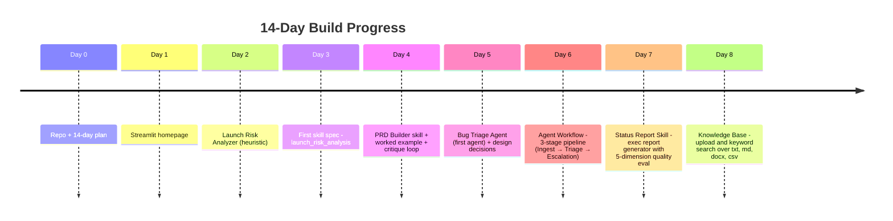
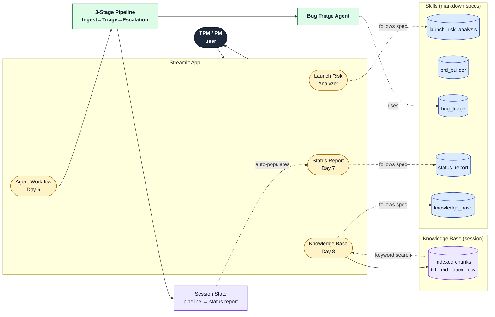

<div align="center">

# 🚀 AI TPM Copilot

A 14-day advanced vibe coding challenge to build an AI-powered TPM/Product Management Copilot.

[](https://www.python.org/)
[](LICENSE)
[](https://streamlit.io/)
[](#progress)
[](https://shwsingh.github.io/pm-tpm-ai-tools/)

📝 **Weekly blog:** [shwsingh.github.io/pm-tpm-ai-tools](https://shwsingh.github.io/pm-tpm-ai-tools/)

</div>

---

## Project Goal

Build a portfolio-quality AI TPM Copilot capable of:

### TPM Use Cases

* Launch Risk Analysis
* Bug Triage
* Dependency Management
* PRD Generation
* Executive Reporting
* Customer Feedback Analysis

### AI Engineering

* Skills
* Agents
* RAG
* Evaluation Frameworks
* Multi-Agent Systems

### Agent Infrastructure

* MCP Servers
* Agent Workflows

## Quick Start

```bash
# 1. Clone the repository
git clone https://github.com/<your-username>/pm-tpm-ai-tools.git
cd pm-tpm-ai-tools

# 2. Create and activate a virtual environment
python -m venv venv
source venv/bin/activate        # On Windows: venv\Scripts\activate

# 3. Install dependencies
pip install streamlit

# 4. Run the app
streamlit run projects/tpm_pm_toolkit/app.py
```

## Progress

| Day    | Capability              | Status     |
| ------ | ----------------------- | ---------- |
| Day 1  | TPM/PM Toolkit Homepage | ✅ Complete |
| Day 2  | Launch Risk Analyzer    | ✅ Complete |
| Day 3  | Launch Risk Skill       | ✅ Complete |
| Day 4  | PRD Builder Skill       | ✅ Complete |
| Day 5  | Bug Triage Agent        | ✅ Complete |
| Day 6  | Agent Workflow          | ✅ Complete |
| Day 7  | Status Report Skill     | ✅ Complete |
| Day 8  | Knowledge Base / RAG    | ✅ Complete |
| Day 9  | Feedback Agent          | ☐ Planned  |
| Day 10 | Dependency Agent        | ☐ Planned  |
| Day 11 | Evaluation Framework    | ☐ Planned  |
| Day 12 | Multi-Agent System      | ☐ Planned  |
| Day 13 | TPM MCP Server          | ☐ Planned  |
| Day 14 | Executive TPM Copilot   | ☐ Planned  |

### Build timeline



### Current architecture (Day 8)



**Legend** — yellow = UI section, green = agent, blue cylinder = skill spec, navy = user, purple = data store / session state.

Full per-day delta diagrams, planned-future layer, mindmap, and Gantt → [`challenge/project_evolution.md`](challenge/project_evolution.md).

## Project Structure

```
pm-tpm-ai-tools/
├── challenge/                  # 14-day challenge plan & tracking
│   ├── 14_day_plan.md
│   ├── progress_tracker.md
│   └── project_evolution.md   # Visual diagrams: timeline, architecture, mindmap, Gantt
├── demos/                      # Demo recordings and assets
├── lessons_learned/            # Notes from each day's build
│   ├── common_errors.md
│   └── day1_day2_lessons.md
├── mcp_servers/
│   └── tpm_copilot_mcp/       # MCP server for TPM workflows
├── notes/                      # Working notes
├── projects/
│   └── tpm_pm_toolkit/         # The Streamlit application
│       └── app.py
├── agents/                     # Agent contracts (planner, tools, escalation)
│   └── bug_triage_agent.md
├── design_decisions/           # Per-day design choices with pros/cons
│   └── day5_bug_triage_agent.md
├── examples/                   # Worked examples produced by skills
│   └── prd_ai_tpm_copilot.md
├── skills/                     # Reusable AI skill definitions
│   ├── bug_triage.md
│   ├── launch_risk_analysis.md
│   └── prd_builder.md
├── LICENSE
└── README.md
```
## Planned Advanced Capabilities

### TPM MCP Server

The MCP server will expose:

#### Resources
* Launch Checklist
* Risk Register
* Capacity Plan

#### Tools
* Launch Risk Analysis
* Executive Status Generation
* Escalation Creation

#### Prompts
* Launch Readiness Review
* Weekly Executive Update
* Capacity Review

## Documentation

### Skills

Reusable AI skill definitions live in [`skills/`](skills/).

### Challenge Roadmap

See [`challenge/14_day_plan.md`](challenge/14_day_plan.md).

### Lessons Learned

See [`lessons_learned/day1_day2_lessons.md`](lessons_learned/day1_day2_lessons.md).

### Common Errors & Fixes

See [`lessons_learned/common_errors.md`](lessons_learned/common_errors.md).

## Planned Advanced Capabilities

### MCP Server

A TPM-focused MCP server exposing:

#### Resources
- Launch Checklist
- Risk Register
- Capacity Plan

#### Tools
- Launch Risk Analysis
- Executive Status Generation
- Escalation Creation

#### Prompts
- Launch Readiness Review
- Weekly Executive Update
- Capacity Review

This demonstrates practical application of MCP for enterprise TPM workflows and agentic AI systems.

## Current Application

Location: [`projects/tpm_pm_toolkit/app.py`](projects/tpm_pm_toolkit/app.py)

Current Features:

* TPM Dashboard Homepage
* Launch Risk Analyzer
* Risk Detection
* Executive Summary
* Launch Health Assessment
* Launch Risk Analysis Skill
* PRD Builder Skill
* Bug Triage Agent (heuristic, LLM-swap stub for Day 9)

## Tech Stack

* Python
* Streamlit
* Git
* GitHub
* VS Code
* AI Coding Assistants
* MCP (Model Context Protocol)
* Agentic AI

## Author

**Shweta Singh**

Building an AI TPM Copilot through a 14-day advanced vibe coding challenge.
