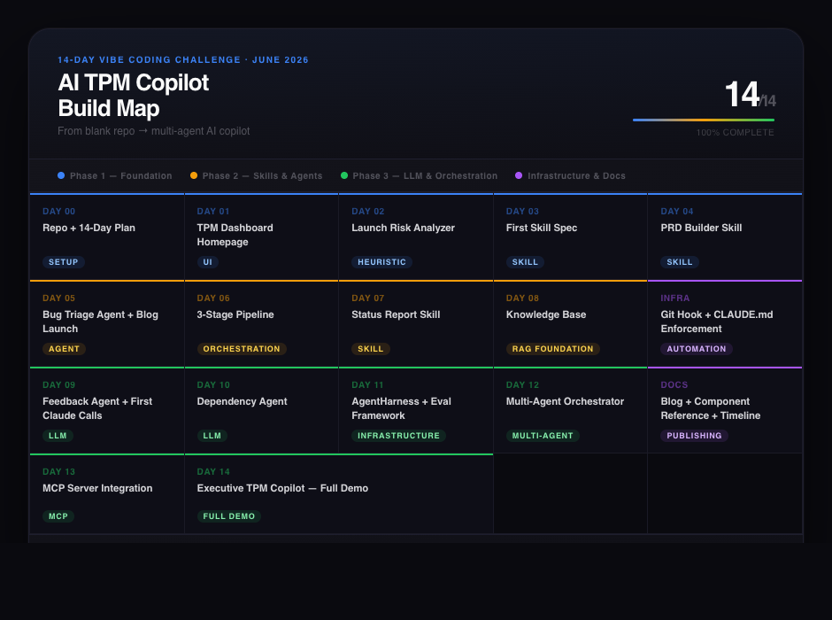
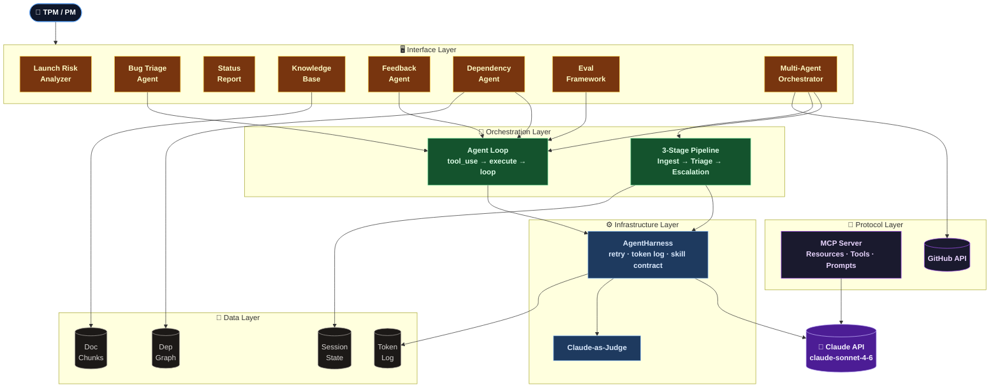

<div align="center">

# AI TPM Copilot

A 14-day vibe coding challenge — from blank repo to multi-agent AI copilot for TPMs.

[](#capabilities)
[](https://www.python.org/)
[](https://streamlit.io/)
[](LICENSE)

[Blog](https://shwsingh.github.io/pm-tpm-ai-tools/) · [Component Reference](https://shwsingh.github.io/pm-tpm-ai-tools/components.html) · [GitHub](https://github.com/shwsingh/pm-tpm-ai-tools)

</div>

---

## What this is

A Streamlit app that ships one working TPM capability per day — starting with keyword heuristics, graduating to Claude-powered agents, multi-agent orchestration, and a real MCP server wired to Claude Desktop. Every day is a committed, demo-able increment.

Built by **Shweta Singh** · Senior Manager, TPM · Google

---

## Capabilities

[](https://shwsingh.github.io/pm-tpm-ai-tools/)

| Capability | What it does | AI concept |
|-----------|-------------|------------|
| **Launch Risk Analyzer** | Scores a launch across 5 risk dimensions, flags signals, gives GO/NO-GO | Heuristic → LLM |
| **Bug Triage Agent** | Classifies severity (P0–P3), assigns owner, decides escalate vs. route-to-lead | Agent + output contract |
| **3-Stage Pipeline** | Ingest → Triage → Escalation Handler, stage outputs feed next stage | Orchestration |
| **Status Report Skill** | Structured input → exec report → 5-dimension quality eval | Skill spec + eval |
| **Knowledge Base** | Upload `.txt` `.md` `.docx` `.csv`, keyword-chunked search | RAG foundation |
| **Feedback Agent** | Per-item sentiment + themes + severity, aggregate TPM next steps | LLM + Claude |
| **Dependency Agent** | Reasons over full dependency graph — critical path, cascading risks | LLM graph reasoning |
| **AgentHarness + Evals** | Unified Claude calls with retry/logging; Claude-as-judge scores outputs | Infrastructure + eval |
| **Multi-Agent Orchestrator** | Free-text request → agent loop → Claude picks tools → exec briefing | Multi-agent + tool use |
| **MCP Server** | Resources, tools, and prompts exposed to Claude Desktop via MCP protocol | MCP |
| **Executive TPM Copilot** | Live GitHub data + all agents → one exec briefing with velocity + status | Capstone |

---

## Quick start

```bash
git clone https://github.com/shwsingh/pm-tpm-ai-tools.git
cd pm-tpm-ai-tools
source venv/bin/activate
streamlit run projects/tpm_pm_toolkit/app.py
```

> Requires `ANTHROPIC_API_KEY` for Days 9–14 features.

---

## Architecture

<details>
<summary>Day 14 — layered architecture</summary>



**Layers explained:**

| Layer | Role | Key components |
|-------|------|---------------|
| Interface | What the user sees and types into | 9 Streamlit sections, one per capability |
| Orchestration | How work gets routed and sequenced | Agent loop (Claude decides), 3-stage pipeline (code decides) |
| Infrastructure | Cross-cutting: reliability, cost, eval | AgentHarness (retry, token log), Claude-as-judge |
| LLM | All model calls, one place | Claude API via AgentHarness |
| Data | Persistence within a session | Session state, doc chunks, dep graph, token log |
| Protocol | External systems | MCP server (Claude Desktop), GitHub API (live data) |

→ [Full component reference](https://shwsingh.github.io/pm-tpm-ai-tools/components.html)

</details>

---

## Blog

Three posts published — deep-dive series coming next:

| Post | What it covers |
|------|---------------|
| [Week 1 — The contract before the code](https://shwsingh.github.io/pm-tpm-ai-tools/) | Days 0–5: why output contracts matter more than models |
| [Week 2 — What AI made me honest about](https://shwsingh.github.io/pm-tpm-ai-tools/) | Days 6–12: skills, agents, evals, and what I'd been doing on autopilot |
| [Challenge complete — 14 days, 14 capabilities](https://shwsingh.github.io/pm-tpm-ai-tools/) | Full retrospective: what shipped, what surprised me, what's next |

**Coming next** — a deep-dive series on each capability:
- How the output contract made the LLM swap on Day 9 a one-line change
- Why I built the eval framework on Day 11, not Day 1 — and what it cost me
- MCP from scratch: Resources vs. Tools vs. Prompts, and when each one matters
- The multi-agent orchestrator: what changed when Claude started calling the tools

---

## Docs

| Resource | Link |
|----------|------|
| 14-day plan | [`challenge/14_day_plan.md`](challenge/14_day_plan.md) |
| Progress tracker | [`challenge/progress_tracker.md`](challenge/progress_tracker.md) |
| Design decisions | [`design_decisions/`](design_decisions/) |
| Lessons learned | [`lessons_learned/`](lessons_learned/) |
