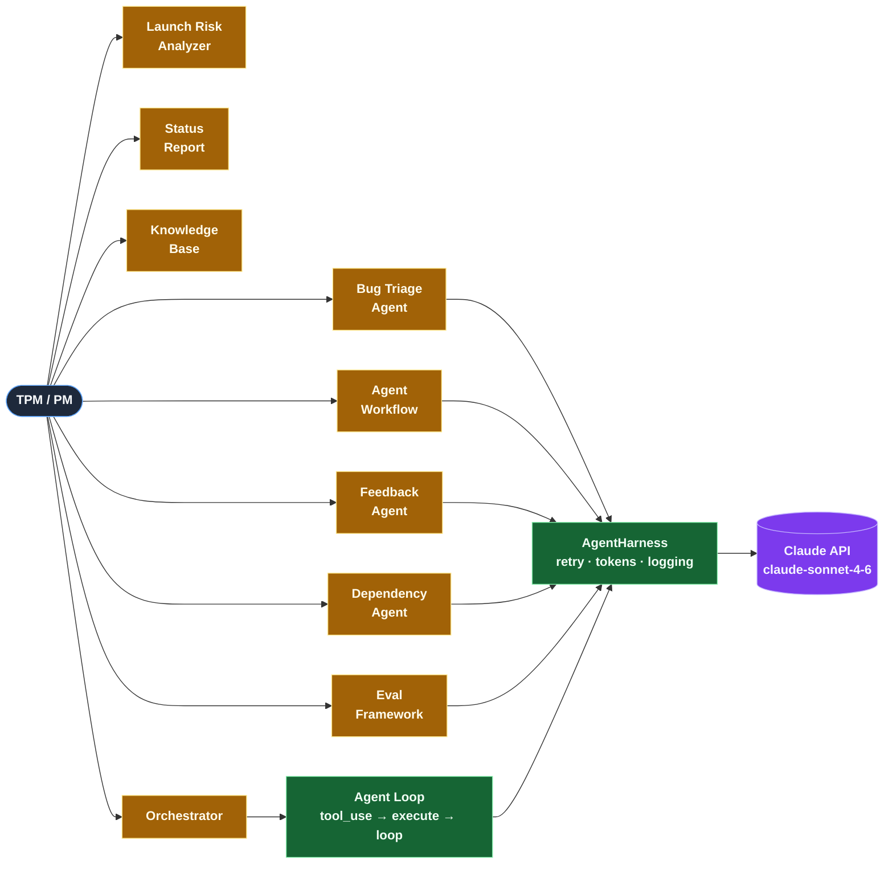

<div align="center">

# AI TPM Copilot

A 14-day vibe coding challenge — from blank repo to multi-agent AI copilot for TPMs.

[](#whats-built)
[](https://www.python.org/)
[](https://streamlit.io/)
[](LICENSE)

[Blog](https://shwsingh.github.io/pm-tpm-ai-tools/) · [Interactive Timeline](https://shwsingh.github.io/pm-tpm-ai-tools/timeline_gitbranch.html) · [Component Reference](https://shwsingh.github.io/pm-tpm-ai-tools/components.html)

</div>

---

## What this is

A Streamlit app that grows one capability per day — starting with keyword heuristics, graduating to Claude-powered agents, multi-agent orchestration, and (Day 13) a real MCP server wired to Claude Desktop. Each day is a working, committed, demo-able increment.

Built by **Shweta Singh** · Senior Manager, TPM · Google

---

## What's built

| Day | Capability | Tag |
|-----|-----------|-----|
| 0 | Repo + 14-day plan | Setup |
| 1 | TPM Dashboard | UI |
| 2 | Launch Risk Analyzer | Heuristic |
| 3 | First Skill Spec | Skill |
| 4 | PRD Builder | Skill |
| 5 | Bug Triage Agent + Blog | Agent |
| 6 | 3-Stage Pipeline | Orchestration |
| 7 | Status Report Skill | Skill |
| 8 | Knowledge Base | RAG |
| 9 | Feedback Agent + First Claude Calls | LLM |
| 10 | Dependency Agent | LLM |
| 11 | AgentHarness + Eval Framework | Infrastructure |
| 12 | Multi-Agent Orchestrator | Multi-Agent |
| 13 | MCP Server Integration | *coming* |
| 14 | Executive TPM Copilot | *coming* |

→ **[View interactive timeline](https://shwsingh.github.io/pm-tpm-ai-tools/timeline_gitbranch.html)**

---

## Quick start

```bash
git clone https://github.com/shwsingh/pm-tpm-ai-tools.git
cd pm-tpm-ai-tools
source venv/bin/activate
streamlit run projects/tpm_pm_toolkit/app.py
```

> Requires `ANTHROPIC_API_KEY` set in your environment for Days 9–12 features.

---

## Architecture

<details>
<summary>Day 12 — component diagram</summary>



All Claude calls route through `AgentHarness`. The Day 12 orchestrator adds an agent loop on top.
→ [Component reference](https://shwsingh.github.io/pm-tpm-ai-tools/components.html)

</details>

---

## Docs & links

| Resource | Link |
|----------|------|
| Weekly blog | [shwsingh.github.io/pm-tpm-ai-tools](https://shwsingh.github.io/pm-tpm-ai-tools/) |
| Interactive timeline | [timeline_gitbranch.html](https://shwsingh.github.io/pm-tpm-ai-tools/timeline_gitbranch.html) |
| Component reference | [components.html](https://shwsingh.github.io/pm-tpm-ai-tools/components.html) |
| 14-day plan | [`challenge/14_day_plan.md`](challenge/14_day_plan.md) |
| Progress tracker | [`challenge/progress_tracker.md`](challenge/progress_tracker.md) |
| Lessons learned | [`lessons_learned/`](lessons_learned/) |
