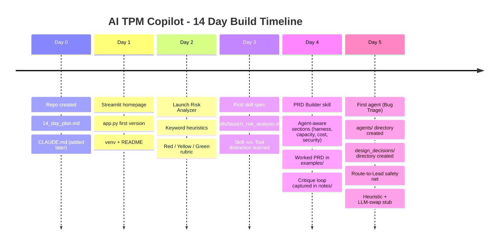
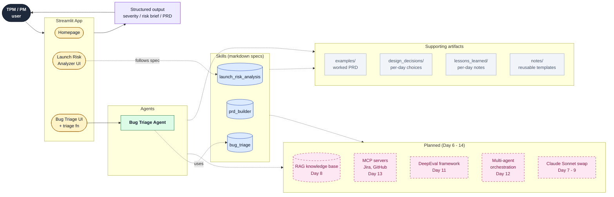
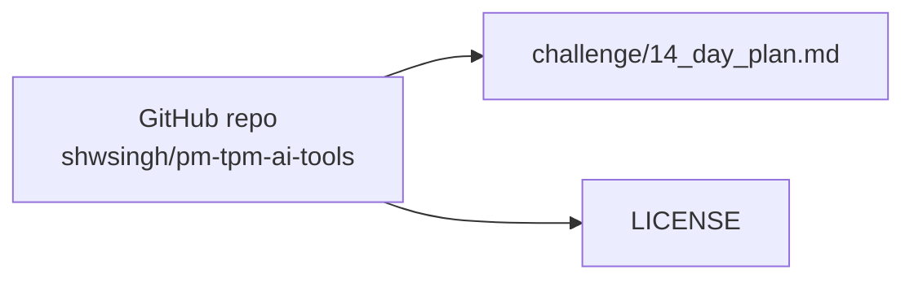
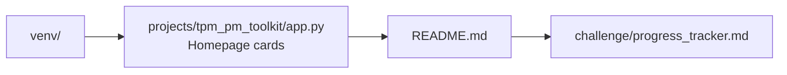
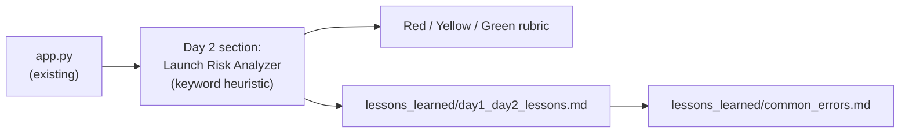
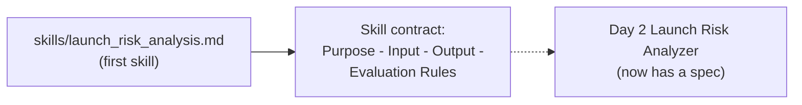
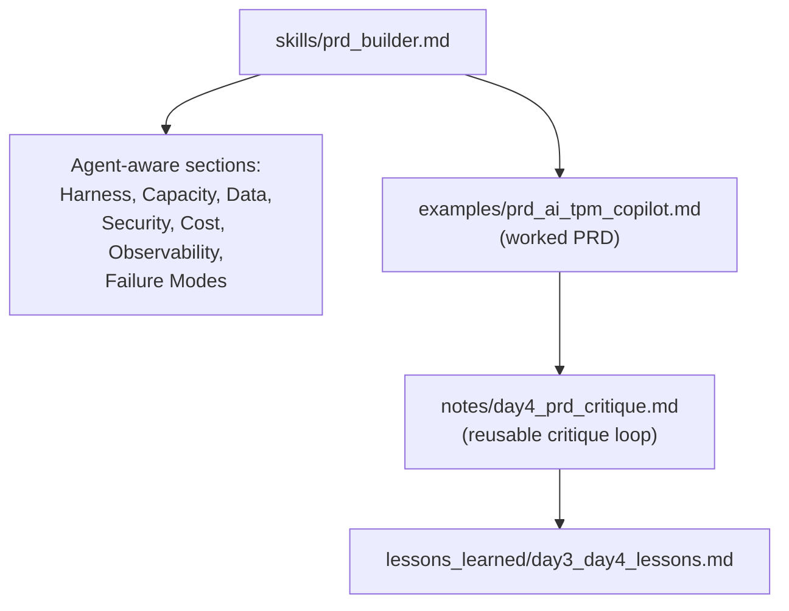
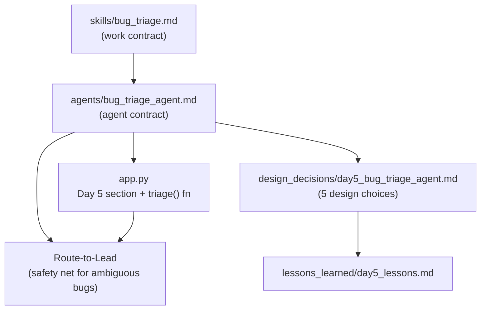
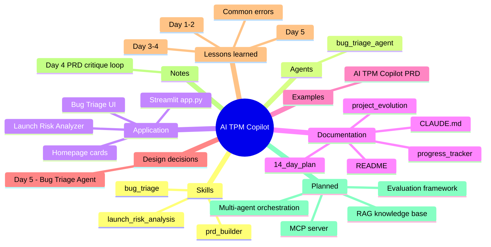
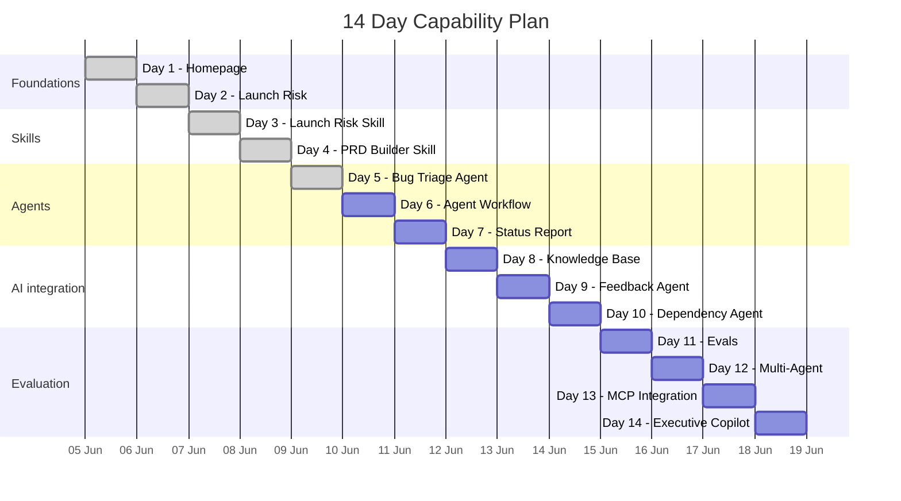

# Project Evolution

Visual record of how the AI TPM Copilot is built up, day by day.

GitHub renders Mermaid blocks natively. Each diagram below is real Mermaid — you can edit the text and the picture updates.

---

## 1. Timeline (Day 0 → Today)

---

## 2. Architecture as it stands today (Day 5)

Read this left-to-right: a TPM pastes input, the Streamlit app routes it to the right capability, agents (when present) consume skills and return structured output. Shapes encode role — rounded = UI, rectangle = agent, cylinder = skill spec. Dashed/pink = planned for later days.

### Legend

| Shape / colour | Means |
|---|---|
| Dark navy oval | User |
| Yellow rounded box | Streamlit UI surface |
| Green rectangle | Agent — runtime logic, consumes skills |
| Blue cylinder | Skill — markdown spec, the work contract |
| Purple rectangle | Structured output returned to the user |
| Gray box (dashed link) | Supporting artifact (lessons, design decisions, examples, notes) |
| Pink dashed box | Planned for a later day |

### When each piece was added

| Component | Day |
|---|---|
| Homepage | Day 1 |
| Launch Risk Analyzer UI | Day 2 |
| `skills/launch_risk_analysis.md` | Day 3 |
| `skills/prd_builder.md` + `examples/` + `notes/` | Day 4 |
| `skills/bug_triage.md` + `agents/` + `design_decisions/` + Bug Triage UI | Day 5 |
| RAG, MCP, DeepEval, multi-agent, LLM swap | Day 6 – 14 (planned) |

---

## 3. Per-day deltas — what each day added

Each diagram shows only the **new** boxes added that day, with arrows to what they integrate with.

### Day 0 — Repo created

State at end of Day 0: empty repo with a 14-day plan and a license. No code yet.

### Day 1 — Streamlit homepage

Added: virtualenv, the first app.py with placeholder homepage cards for the planned modules, README, and the progress tracker.

### Day 2 — Launch Risk Analyzer

Added: the first real capability, lessons file, and common-errors file.

### Day 3 — First skill

Added: the very first skill spec. The Day 2 analyzer code did not change today; what changed is that the *behavior* is now documented as a reusable contract.

### Day 4 — PRD Builder + critique loop

Added: second skill, worked example PRD revised through a senior-PM critique pass, and the critique loop captured as a reusable note.

### Day 5 — Bug Triage Agent (today)

Added: first agent (separate from skill), the agents/ and design_decisions/ directories, route-to-Lead safety net, and a smoke test that produced real evidence (logged into the design decisions doc).

---

## 4. Mindmap of the current state

A radial view of everything that exists today, grouped by purpose.

---

## 5. 14-day plan as a Gantt

The first LLM call in the project is expected at Day 7 (Status Report needs summarization). The Bug Triage Agent flips from heuristic to LLM-backed at Day 9.

---

## 6. How to read this file in 3 months

If you are reviewing this for the portfolio:

1. **Start with Section 1** — the timeline tells you what was built and in what order.
2. **Then Section 2** — the architecture diagram shows how the pieces fit together today, with day labels so you can see what came when.
3. **Use Section 3** — when you want to understand *why* a particular file exists, look at the day delta diagram for that day.
4. **Section 4** — the mindmap is a flat inventory for quick navigation.
5. **Section 5** — the Gantt shows what is still ahead.

---

## 7. How to update this file each day

End of each day, edit Section 1 (add a timeline entry), Section 2 (drop the new boxes in), Section 3 (add a new delta diagram), Section 4 (extend the mindmap), and Section 5 (mark the day as `done`).

If a day has no architectural change (pure docs update), only Section 1 needs an entry.
