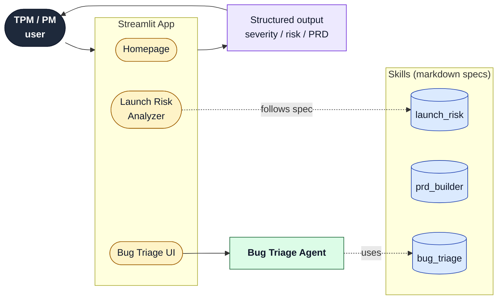

*Week 1 of building an AI assistant for TPMs — what I learned, what I got wrong, and one thing you can try tomorrow.*

**Days 1 – 5 of 14.**

## The five-second takeaway

A good AI tool tells you when it isn't sure. A bad one guesses confidently and hopes you don't notice.
{: .notice--primary}

Every AI tool you use at work — including the one you're about to build — should have an explicit "I don't know, please decide" path. If it doesn't, you can't trust it.

That single design decision was the most useful thing I did in week 1. The rest of this post is how I got there.

## What I'm building

I'm spending 14 days building an **AI assistant for TPMs** — the kind of AI tool that handles the work a Technical Program Manager does every week:

- Launch risk briefs
- Bug triage
- PRD scaffolding
- Weekly executive status reports
- Cross-team dependency tracking

I'm doing it in public on GitHub: [github.com/shwsingh/pm-tpm-ai-tools](https://github.com/shwsingh/pm-tpm-ai-tools).

I'm a TPM building for TPMs. Every design decision is shaped by what I actually want when I'm writing the Friday status update at 7pm. This post is week 1 of 2.

## Where I am after 5 days

| What | Done |
|---|---|
| Streamlit app with a homepage | ✅ |
| Launch Risk Analyzer (paste raw notes → structured brief) | ✅ |
| PRD Builder (rough idea → exec-ready PRD) | ✅ |
| Bug Triage Agent (bug report → severity, owner, next action) | ✅ |
| Documented architecture a non-engineer can read | ✅ |
| AI model integrated | **Not yet** (intentionally) |

That last row surprises people. Five days in and I haven't made a single call to Claude or GPT yet. **That's on purpose.**

Week 1 is about getting the *structure* right — what the AI takes in, what it spits out, what it does when it's not sure. Week 2 plugs in the actual model.

If you wire up the model first, you spend the rest of the project apologizing for a bad output shape.
{: .notice--warning}

**The shape of the AI's job is more important than which AI model you pick. Pick the shape first. Pick the model second.**

### The architecture as it stands today

Read it left-to-right. **Yellow = UI, green = agent, blue cylinder = skill spec, navy = user, purple = output.** Each box is labeled with what role it plays, not which day it was added — the timeline lives [here]({{ site.repository | prepend: "https://github.com/" }}/blob/main/challenge/project_evolution.md).

## The design decision that mattered most

I'll tell you the story directly.

The Bug Triage Agent takes a bug report and decides three things: how bad it is (P0–P3), who should own it, and what's the next action. I built it on Day 5 using simple keyword matching — no AI model yet. Standard week-1 work.

Then I tested it with six real-sounding bugs.

> Three of the six came back saying "Ask Shweta."

At first that felt like the system failing. Half the bugs got punted to a human. A 50% miss rate.

Then I realized that's exactly what I designed it to do.

The agent has an explicit rule: if it isn't confident — if the bug is vague, the signals are mixed, the evidence is thin — it does **not** guess. It sets the owner to "Shweta as Lead" and the next action to "Reach out to Shweta for triage discussion." It tags the summary `[NEEDS LEAD]`. It does not pretend to know.

The half of the bugs it routed to me weren't a bug in the agent. They were the agent **honestly admitting it couldn't do the job those six bugs needed.** Because it was honest, I knew which bugs needed a human. The other half it triaged confidently and I trusted those results.

A 50% "I don't know" rate is not a failure. A 0% "I don't know" rate is a failure — because nothing is right 100% of the time, and any system that claims it is, is lying.
{: .notice--success}

This pattern works for anything you build with AI. Your output schema should include a "confidence" field, and the answer should sometimes be "low — please escalate." If it never says low, you've designed it wrong.

## Five decisions I'm glad I made

### 1. Pick the output shape before picking the model

Week 1 has no AI model. The Bug Triage function returns a Python dictionary with the same eight fields it'll have when Claude is plugged in on Day 9. The model is replaceable; the output contract is permanent. Most AI projects do this backwards and pay for it later.

### 2. Make the AI route low-confidence answers to a named human

Not a queue. Not a "needs review" inbox. A named human (me). **Queues never get drained. Named humans do.** This is the takeaway from the top of the post.

### 3. Write down design decisions on the day I make them

I started a `design_decisions/` folder. Every day with a real choice gets a markdown file: what I picked, what I considered, why, pros, cons, and when to revisit. In six months I won't remember why I picked Option 2 over Option 3. The doc will. The 10 minutes to write it is the cheapest insurance in the project.

### 4. Critique my own PRD before calling it done

On Day 4 I generated a PRD using my own PRD-writing tool. The first draft looked great. Then I put on the senior-reviewer hat and tore it apart — no evidence for the problem, made-up market sizing, no pricing, and a timeline that ignored the six-month SOC2 audit window.

I rewrote it. The launch date moved from October 2026 to February 2027 because compliance can't go faster than compliance.

Templates make a document look complete. They don't make it correct.
{: .notice--info}

### 5. Separate "what the AI does" from "when the AI does it"

Boring-sounding but it matters. The *what* lives in a file under `skills/` (markdown). The *when* lives in a file under `agents/` (also markdown). When I get to multi-agent orchestration in week 2, this split is the difference between "easy" and "rewrite the project."

## Two things I got wrong

### 1. My first PRD draft was every section bullet-pointed

It looked technically correct and read like a checklist. A senior PM document is mostly prose. I rewrote with full sentences in the narrative sections and kept bullets only for things that genuinely are lists (requirements, metrics, milestones). Now it reads like an actual PRD.

**Takeaway:** bullets are a default, not a writing choice. If you can't say it in a sentence, you don't know it well enough.

### 2. I underestimated how bad keyword matching is at understanding bugs

I built the Bug Triage Agent's classifier with hard-coded keywords like "outage," "data loss," "revenue stop." Then I tested it with the bug:

> "The checkout page is throwing 500 errors for all users in the EU region since the last deploy. Revenue is dropping."

It missed. "Revenue is dropping" isn't the literal string "revenue stop." It saw one minor keyword and routed the bug to me as Lead. The route-to-Lead safety net caught it, but the underlying classifier was worse than I expected.

I'm not fixing it. On Day 9 the AI model goes in and the keyword brittleness disappears. The mistake was assuming keyword matching was "close enough" for the demo. It isn't.

## What I learned about building AI tools in general

Three things, said as plainly as I can:

1. **The shape of the output is the artifact that survives.** The AI model is replaceable. The contract isn't. Spend more time on the contract than you think you should.
2. **Make "I don't know" a first-class answer.** Every probabilistic system needs an honest escape hatch, and that escape hatch should route to a named human.
3. **Write down why you made a decision on the day you made it.** Future you will not remember. The cost of writing is small. The cost of forgetting is large.

## What week 2 looks like

| Day | What ships | Why a TPM might care |
|---|---|---|
| Day 6 | Multi-step workflow | Bug Triage hands off to escalation automatically |
| Day 7 | Status Report generator | This is where I plug in Claude. First real AI call. |
| Day 8 | Knowledge base over past launches and runbooks | The assistant can answer "has this happened before?" |
| Day 9 | Bug Triage upgraded to real AI reasoning | The classifier finally stops missing "revenue is dropping" |
| Day 10 | Cross-team dependency tracker | The thing I personally spend Wednesday afternoons on |

Day 9 is the one I'm most curious about. The whole "pick the shape first, pick the model second" bet rides on it. If the swap from keyword matching to Claude is genuinely a small change, the architecture I picked is right. If it isn't, I learned something important and the design was wrong.

That's the next blog post.

## One thing you can try tomorrow

Pick any AI tool you use at work — ChatGPT, Copilot, Notion AI, your internal LLM, whatever. Ask it a hard question in your domain. Then check: is it confident? Is it citing sources? Does it ever say "I'm not sure"?

If it never says "I'm not sure," start treating its outputs with the same skepticism you'd give a confident intern on day one. **Confidence without humility is a red flag in humans and in AI.**

If you're building an AI tool yourself: add an "I don't know" output to your schema. Today. Before you ship.
{: .notice--danger}

## How to follow along

- **Repo:** [github.com/shwsingh/pm-tpm-ai-tools](https://github.com/shwsingh/pm-tpm-ai-tools)
- **Visual diagrams of the project day by day:** [`challenge/project_evolution.md`](https://github.com/shwsingh/pm-tpm-ai-tools/blob/main/challenge/project_evolution.md)
- **Per-day design decisions:** [`design_decisions/`](https://github.com/shwsingh/pm-tpm-ai-tools/tree/main/design_decisions)

The next post lands at the end of week 2 (Day 10). Same structure: what shipped, what I'd do differently, what surprised me, and one thing you can try Monday.

---

### For the engineers reading this

A few technical notes I left out of the main post:

- The Bug Triage Agent's output schema is a Python dict with `severity`, `component`, `owner`, `priority`, `next_action`, `escalate`, `needs_lead`, `summary`. The keyword classifier on Day 5 and the Claude call on Day 9 return identical shapes.
- The route-to-Lead rule fires on: severity = Unknown; P0/P1 inferred from a single keyword hit; conflicting signals (P0 keyword alongside P2 keyword); unknown component; ambiguity keywords ("maybe", "not sure", "sometimes") in the report.
- Skills are markdown specs only — no code. Purpose, Input, Output, Evaluation Rules, Expected Output Format. They're designed to be consumed by agents in later days.
- Evaluation for Day 11: DeepEval against a golden set per skill, three labelers, Cohen's kappa ≥ 0.7 floor.
- MCP wiring for Jira/GitHub lands on Day 13.

Code, diagrams, and full per-day deltas are in the repo.

---

*If you build agentic systems and have a pattern for confidence boundaries you like, I'd love to hear it. The whole point of building in public is to find the things you're getting wrong.*

---

**[→ Browse the full component reference](https://shwsingh.github.io/pm-tpm-ai-tools/components.html)** — every module in the architecture with role, impact, and a link to its source.
